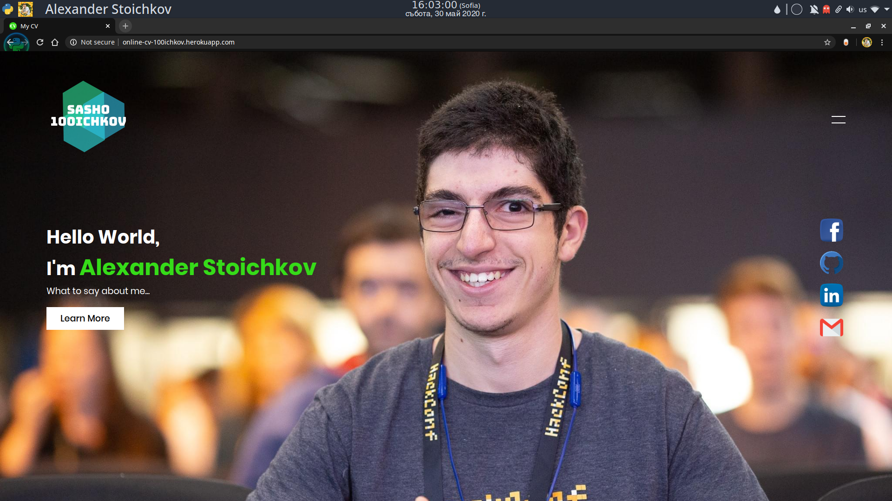
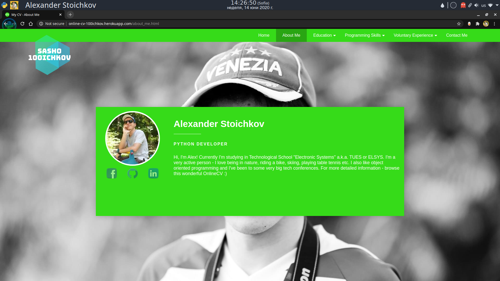
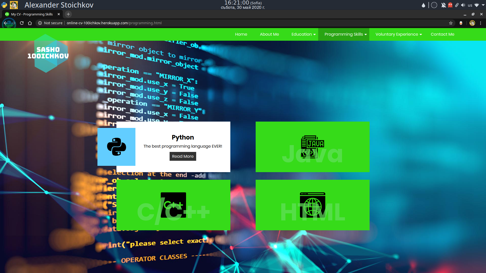
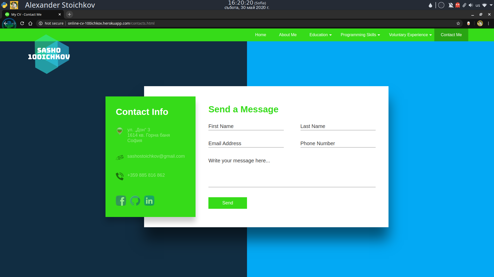

# Online CV

## Purpose
The main purpose of this project is to become personal online CV for me to use in my future career. I'll be adding more information about me and about everything I do. I could also add a BLOG section.

## This site is hosted on https://online-cv-100ichkov.herokuapp.com/

## Screenshots

Requirements

## Must use:
1. - [x] Gulp build setup
2. - [x] Sass for source files
3. - [x] If JS - ES6+ with Babel
4. - [x] Flex for layouts

## Requirements
- [x] Host the code as on GitHub
- [x] Host the site itself on free services like github sites for easy preview
- [x] Must style at least 5 different layouts for the site
- [x] Must have a page that showcases styles for standard HTML elements
- [ ] Must have two or more levels deep drop down menu in the header
- [x] Must be responsive (no horizontal scrolls on any viewport)
- [x] Must get no errors or warnings from the HTML5 Validator
- [x] Must have realistic content. Your site has to be useful in some way, no lorem ipsum.
- [x] Must have well formatted code - 4 tab size indentation.
- [x] Must use proper HTML5 semantic tags
- [x] Must have proper README.md in the repository that explains the project and provides a screenshot from the homepage.
- [x] Class names must be lower case, dash separated

## Bonus points:
Bonus points will add to your final score if you are off by a little:
- [x] JS interactivity (in a well written JS code).
- [x] No jQuery used, just vanilla JS

